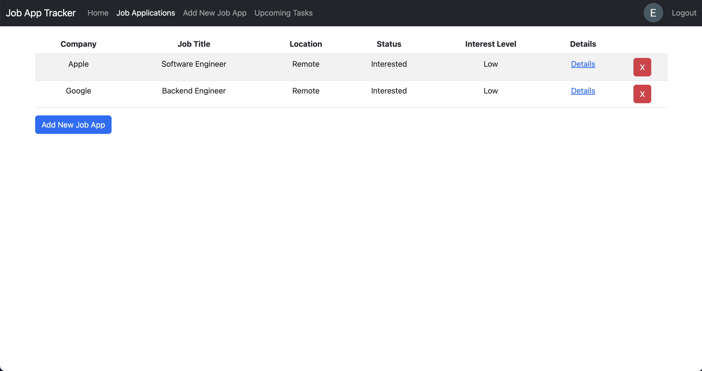

# Job Application Tracker

## Background

    This Job Application Tracker is a web application that helps job seekers manage the job application process. Users can create new job application entries, add contact information, save links to resumes and cover letters that were sent, and create tasks. 

## Technologies Used

    Technologies used in this project: HTML5, CSS3, Bootstrap, JavaScript, Node.js, Express.js, MongoDB, Mongoose, and OAuth2 (Google Strategy).

# Getting Started

### Trello Board Link https://trello.com/b/7QVUerin/job-app-tracker-ga-project-2
### Application Link https://job-application-tracker-et.herokuapp.com/

    To get started, click on the above link and log in. The application's authorization system is managed by OAuth using the Google OAuth2 strategy. 

  

    Once logged in, the user will be able to create and view job applications. 

  

    To add new applications, click the "Add New Job App" button or click on the link in the navbar. This will lead the user to a form to create the new application.

  

    Once a new app is added, the user can view details for that specific job app. On this page, the user can view the job details, add a link to the resume and cover letter that was submitted, add recruiter contact information, and add and update tasks.

  

    Users can also view all upcoming tasks (tasks that have a due date within 7 days of the current date) on a single "Upcoming Tasks" page. Users can update and delete tasks directly from this page.

  

# Next Steps

## Icebox Items
<ul>
    <li>Search functionality on the job application index page</li>
    <li>View, sort, and filter functionality on the job application index page</li>
    <li>Add tags to job applications for users to create custom categories to sort by</li>
    <li>Connect to Google Calendar API to auto-generate calendar events for tasks</li>
    <li>Create a metrics page that allows users to view job application progress such as number of apps sent, number of offers, etc.</li>
</ul>