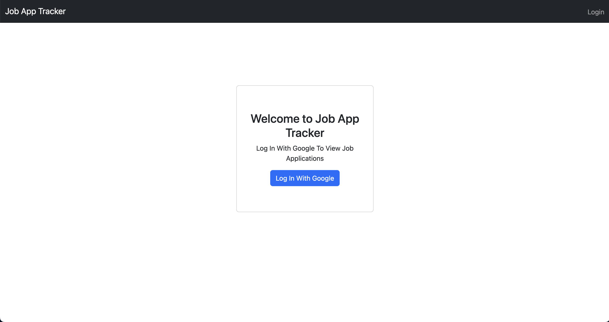
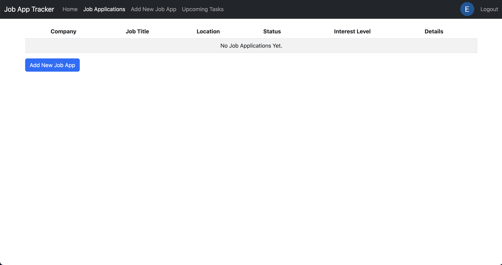
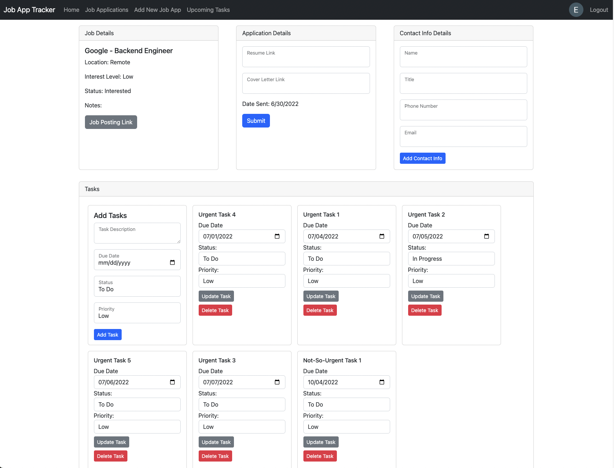
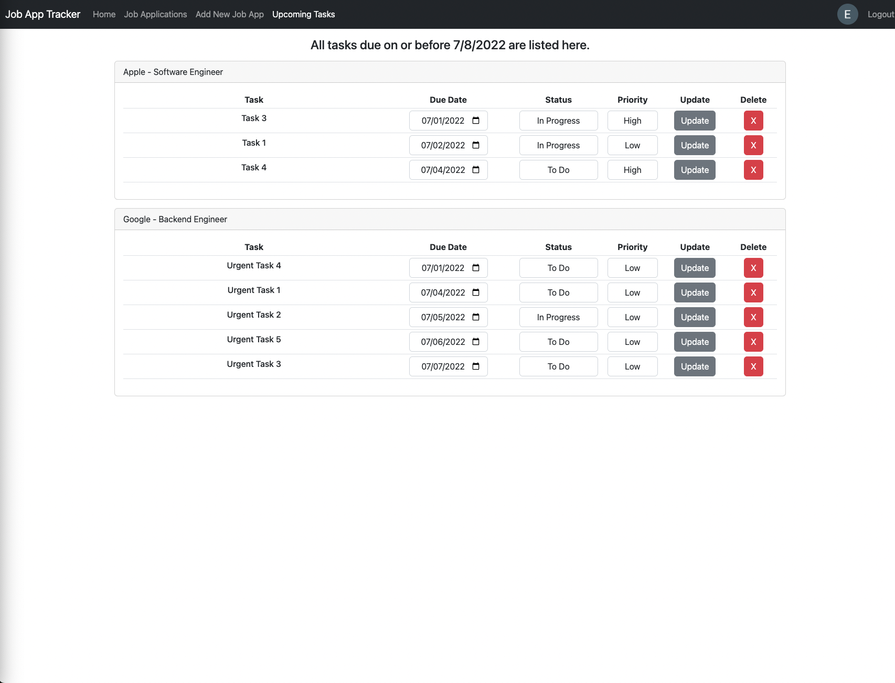

# Job Application Tracker

## Background

    This Job Application Tracker is a full stack web application that helps job seekers manage the job application process. Users can create new job application entries, add contact information, save links to resumes and cover letters that were sent, and create tasks.

## Application Architecture

    The application is structured to follow Express.js best practices and the Model-View-Controller (MVC) architecture. The application is scaffolded using Express-Generator and it utilizes the EJS View Engine. Data resources have separate model, view, controller, and router files to isolate CRUD operations for each data resource. Isolating data resources in this manner is good practice because it allows developers to quickly and consistently identify which files to visit while troubleshooting issues and when adding new features for existing data resources. Utilizing this architecture makes this application maintainable and feature-scalable moving forward.

## Authentication and Authorization

    This application utilizes OAuth 2.0 - Google Strategy and Passport.js for user authentication. Users can log in using their Google account to access the features of this application. Once a user is logged in, they are authorized to create, read, update, and delete job application data associated with their user account. Users will not be able to view any data created by other users. 

## Technologies Used

The application is deployed via Heroku. Data is stored via MongoDB Atlas (cloud).

Front End Technologies: HTML5, CSS3, Bootstrap, JavaScript, EJS View Engine

Back End Technologies: Node.js, Express.js, MongoDB, Mongoose, and OAuth 2.0 (Google Strategy)

# Getting Started

### Project Planning Board: https://trello.com/b/7QVUerin/job-app-tracker-ga-project-2
### Application: https://job-application-tracker-et.herokuapp.com/

    To get started, click on the application link above and log in. The application's authorization system is managed by OAuth using the Google OAuth2 strategy. 

  

    Once logged in, the user will redirected to the job app index page, which lists out all the user's job applications. From this screen, the user is able to view and delete job applications. 

  

    To add new applications, click the "Add New Job App" button or click on the link in the navbar. This will lead the user to a form to create the new application.

  

    Once a new app is added, the user can view details for that specific job app. The user can navigate to the show (details) page for a specific job application through the "details" links on the job application index page. On the show page, the user can view the job details, add a link to the resume and cover letter that was submitted, add recruiter contact information, and add and update tasks.

  

    Users can also view all upcoming tasks (tasks that have a due date within 7 days of the current date) on a single "Upcoming Tasks" page. Users can update and delete tasks directly from this page.

  

# Next Steps

## Icebox Items
<ul>
    <li>Search functionality on the job application index page</li>
    <li>View, sort, and filter functionality on the job application index page</li>
    <li>Add tags to job applications for users to create custom categories to sort by</li>
    <li>Connect to Google Calendar API to auto-generate calendar events for tasks</li>
    <li>Create a metrics page that allows users to view job application progress such as number of apps sent, number of offers, etc.</li>
</ul>